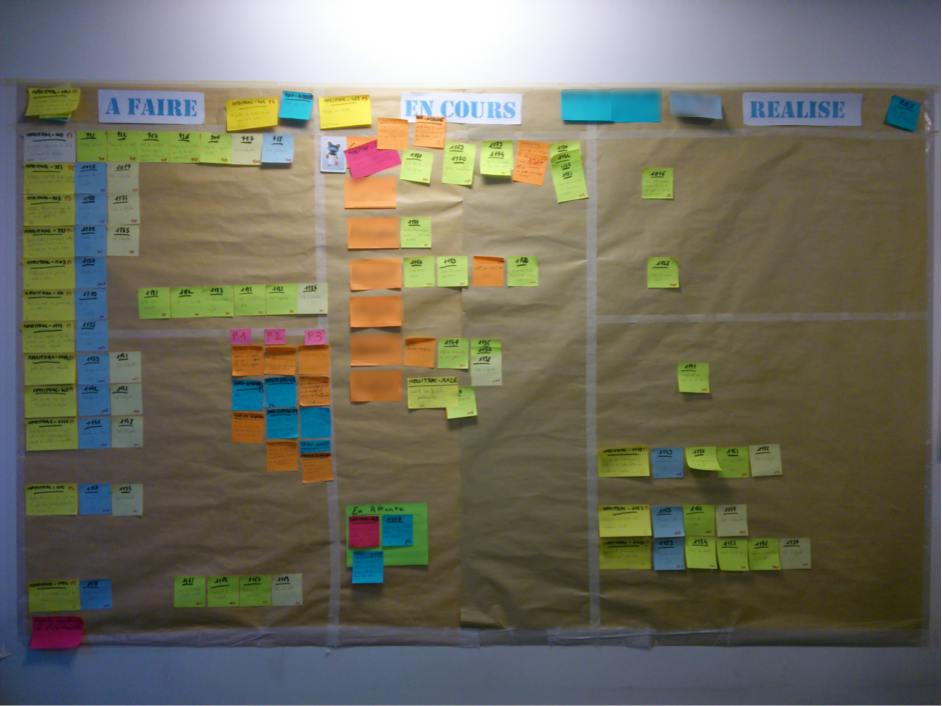

# Présentation des méthodes agiles et Scrum

Cette présentation a pour but de sensibiliser les consultants et futurs informaticiens à la gestion de projet à l'aide des méthodes agiles ainsi qu'aux bonnes pratiques de développements dans un contexte agile. Elle a aussi pour but de présenter leurs avantages et inconvénients par rapport à d'autres méthodes de gestion de projet à l'exemple du cycle en V.

## Informations sur l'article

L'article a été originellement publié par Idriss Neumann sur developpez.com [ici](https://ineumann.developpez.com/tutoriels/alm/agile_scrum/).

* Publié le 6 décembre 2012
* Mis à jour le 7 février 2015
* Niveau: **confirmé**
* Licence: 

## Généralités sur les méthodes agiles

### Définition

Les méthodes agiles sont des méthodologies essentiellement dédiées à la gestion de projets informatiques. Elles reposent sur des cycles de développement itératifs et adaptatifs en fonction des besoins évolutifs du client. Elles permettent notamment d'impliquer l'ensemble des collaborateurs ainsi que le client dans le développement du projet.

Ces méthodes permettent généralement de mieux répondre aux attentes du client en un temps limité (en partie grâce à l'implication de celui-ci) tout en faisant monter les collaborateurs en compétences. Ces méthodes constituent donc un gain en productivité ainsi qu'un avantage compétitif tant du côté client que du côté du fournisseur.

### Les valeurs communes de ces méthodes

Les méthodes agiles se reconnaissent toutes dans les valeurs suivantes:

* __L'équipe et la communication avant les outils et processus__ : dans la vision agile, l'équipe est bien plus importante que les outils ou les procédures de fonctionnement. Il est préférable d'avoir une équipe soudée et dont les membres communiquent entre eux, composée de développeurs de niveaux différents, plutôt qu'une équipe composée d'experts qui travaillent de manière isolée. La communication est donc une notion fondamentale dans un contexte de développement agile.
* __L'application avant la documentation__ : il est primordial que le projet fonctionne, c'est la priorité avant toute chose. La documentation technique et les autres outils (de tests, de reporting) constituent une aide précieuse, mais ne sont pas une fin en soi. Une documentation précise est utile comme moyen de communication. Il est parfois préférable de simplement commenter abondamment le code lui-même, et surtout de transférer la totalité des compétences et connaissances du métier à l'ensemble des collaborateurs de l'équipe.
* __La collaboration avant la négociation__ : le client doit être impliqué dans le développement. Le fournisseur ne doit pas se contenter de négocier un contrat au début du projet, puis de refuser l'évolution des besoins du client. Le client doit collaborer avec l'équipe et fournir des comptes rendus réguliers sur l'adaptation du logiciel à ses attentes.
* __L'acceptation du changement et la flexibilité avant la planification__ : la planification initiale et la structure du projet doivent être flexibles afin de permettre les évolutions attendues par le client. En effet, les premières livraisons du projet donnent très souvent suite à des demandes d'évolution.

### Le manifeste Agile

Le manifeste Agile (ou « agile manifesto » ) est un texte apparu en 2001 et rédigé par 17 experts du développement logiciel. Ce texte reprend les 4 valeurs communes des méthodes agiles et les dérive en 12 principes précisés ci-dessous.

1. La plus haute priorité est de satisfaire le client en livrant rapidement et régulièrement des fonctionnalités à grande valeur ajoutée.
2. Il faut accueillir positivement les changements et les nouveaux besoins, même lorsqu'ils arrivent tardivement dans un projet. Les processus agiles exploitent la flexibilité au changement afin de fournir un avantage compétitif pour le client.
3. Il faut livrer régulièrement un logiciel opérationnel (utilisable en production) avec des cycles courts (idéalement entre deux et quatre semaines).
4. Les utilisateurs ou leurs représentants et les développeurs doivent travailler ensemble au quotidien et tout au long du projet.
5. Il faut réaliser les projets avec des personnes motivées, leur fournir des environnements adaptés à leur besoin ainsi que le soutien dont ils ont besoin et leur confiance pour atteindre les objectifs fixés.
6. Le dialogue en face à face entre les différents acteurs d'un projet agile est la méthode la plus simple et la plus efficace pour transmettre l'information et la connaissance entre ces derniers.
7. L'aspect opérationnel d'un produit est la principale mesure d'avancement de ce dernier.
8. Les processus agiles doivent amener à un rythme de développement soutenable pour l'équipe et constant (il ne doit pas y avoir de période de forte montée ou baisse de charge de travail ayant des impacts significatifs sur l'équipe).
9. La recherche de l'excellence et de la performance conceptuelle et technique renforce l'agilité d'un produit.
10. Simplifier le travail en minimisant le nombre de tâches inutiles et redondantes est essentiel.
11. Les meilleures solutions logicielles émergent d'équipes autoorganisées tant au niveau de la clarté des spécifications, que de la conception et de la mise en place d'architectures performantes et efficaces.
12. L'équipe doit réfléchir à des moyens, à intervalles réguliers, pour devenir davantage efficace et mettre en pratique ces nouvelles méthodes une fois décidées.

## Présentation de la méthode Scrum

### Fonctionnement général de la méthode Scrum

La méthode __Scrum__ est une méthode agile, créée en 2002, dont le nom est un terme emprunté au rugby qui signifie « la mêlée ». Elle s'appuie sur le découpage des projets en itérations encore nommées « __sprints__ ». Un sprint peut avoir une durée qui varie généralement entre deux semaines et un mois.

Avant chaque sprint, les tâches sont estimées en temps et en complexité à l'aide de certaines pratiques comme le « __planning poker__ », une manière ludique de chiffrer la complexité des tâches ou évolutions à l'aide de cartes à l'instar du célèbre jeu dont le nom est repris. Ces estimations permettent à la fois de planifier les livraisons, mais aussi d'estimer le coût de ces tâches auprès du client. Les fonctionnalités (encore appelées « __user stories__ ») qui font l'objet d'un sprint constituent ce que l'on appelle un « __sprint backlog__ » du produit éventuellement livrable à la fin du sprint. Il est nécessaire de distinguer le sprint backlog du « __product backlog__ » qui lui correspond à l'ensemble des fonctionnalités attendues pour le produit sur l'ensemble des sprints.

La méthode Scrum est aussi caractérisée par une « __mêlée__ » quotidienne, encore appelée « __morning__ » ou « __stand-up__ », dans laquelle les collaborateurs (chefs de projets, développeurs et responsables fonctionnels) indiquent tour à tour les tâches qu'ils ont effectuées la veille, les difficultés rencontrées et enfin ce sur quoi ils vont poursuivre leur travail le jour suivant. Cela permet d'évaluer l'avancement du projet, de mobiliser des ressources là où cela est le plus nécessaire, mais aussi de venir en aide aux collaborateurs rencontrant des difficultés lorsque celles-ci ont déjà été rencontrées auparavant par d'autres membres de l'équipe.

### Les rôles de la méthode Scrum

La méthode Scrum définit trois rôles pour un projet.

1. __Le product owner__ : il s'agit du représentant officiel du client au sein d'un projet Scrum. Il est l'interlocuteur principal du Scrum Master et des membres de l'équipe. Il définit les besoins du produit et rédige les spécifications. Il peut se faire aider de responsables fonctionnels pour la rédaction des spécifications. Il est également chargé de définir et prioriser les users stories pour chaque sprint.
2. __Le scrum master__ : il s'agit d'une personne chargée de veiller à la mise en application de la méthode et au respect de ses objectifs. Il ne s'agit pas d'un chef de projet, mais d'une personne chargée de lever les obstacles éventuels qui empêcherait l'avancement de l'équipe et du projet pendant les différents sprints.
3. __L'équipe (« team members »)__ : ce sont les personnes chargées de la réalisation du sprint et d'un produit utilisable en fin de sprint. Il peut s'agir de développeurs, architectes, personnes chargées de faire des tests fonctionnels...

### Exemple de mise en œuvre d'un sprint

Dans cette partie, nous allons donner un exemple d'application de la méthode Scrum telle qu'elle est mise en œuvre sur certains projets en entreprises. Bien entendu, les rituels tels que présentés peuvent varier d'une entreprise ou organisation à l'autre (voire d'un projet à l'autre dans certaines grandes entreprises) et ne sont pas forcement tous relatifs à la méthode Scrum bien que souvent mis en œuvre dans un contexte agile (c'est notamment le cas de la démarche du « Test Driven Development » que nous allons présenter par la suite).

#### Initialisation du sprint

Les différentes étapes de l'initialisation d'une itération (ou sprint) sont animées et sous la responsabilité du scrum master.

##### Sprint backlog

Le sprint backlog est un ensemble de user stories choisies et priorisées (chaque story doit avoir un niveau de priorité) par le product owner. Le scrum master doit lui s'assurer de bien recevoir un backlog de la part du product owner au début de chaque itération afin de planifier un chiffrage avec le reste de l'équipe côté maîtrise d'ouvrage.

Le backlog ne concerne pas forcément un module applicatif en particulier, mais peut couvrir des aspects fonctionnels de plusieurs modules potentiellement complètement indépendants, mais faisant partie du périmètre du projet.

##### Planning poker

Il s'agit ici du chiffrage des user stories en points d'efforts (ou niveau de complexité). Ce chiffrage se fait à l'aide d'un jeu de cartes (d'où le nom « poker ») dont les nombres sont ceux de la suite de Fibonnaci, chaque carte représentant un nombre en points d'efforts.

Les personnes qui assistent à ce chiffrage sont :

* le Scrum master qui planifie et anime ce chiffrage et qui s'assure que la totalité des points d'efforts décidés en fin de chiffrage n'excède pas le nombre de points d'efforts par itération qui lui a été contractualisé avec le client. Dans le cas ou ce nombre de points d'efforts n'a pas été atteint, le product owner peut décider de rajouter une ou plusieurs user stories au backlog qui seront chiffrées assez vite de la même manière. Dans le cas où ce nombre est dépassé, le scrum master peut demander au product owner de retirer certaines tâches du backlog (généralement les moins prioritaires)
* les collaborateurs MOE (pour « maîtrise d'œuvre ») qui eux sont les seuls à être habilités à fournir un chiffre en points d'efforts. Chaque développeur utilise un jeu de cartes pour fournir un chiffre en points d'efforts. L'utilisation du jeu de cartes leur permet de ne pas être influencés par les autres développeurs au moment du choix du niveau de complexité
* le product owner qui est là pour s'assurer que les besoins et l'ensemble des users story ont bien été comprises par l'ensemble de l'équipe et pour répondre aux questions. Il peut être accompagné par un responsable fonctionnel.
Pour qu'une tâche ait un chiffrage final, il faut que tous les développeurs votent et soient unanimes sur la complexité de la story.

Au premier chiffrage, les participants qui mettent le plus petit et le plus gros nombre de points d'efforts devront justifier leur choix devant le reste de l'équipe et les développeurs, cela permettra à tout le monde de voir s'ils ont oublié de prendre en compte certains paramètres dans leur chiffrage (le temps passé sur les tests par exemple). Les « sachants » (personnes ayant le plus la maîtrise des modules applicatifs concernés par les stories) doivent aussi s'assurer que les autres développeurs aient bien compris ce que représentait l'évolution en termes d'effort à produire.

Au second chiffrage, il arrive régulièrement que l'ensemble des développeurs soient d'accord sur le même chiffre ou bien aient des chiffres assez proches, lorsque ce n'est pas le cas, c'est le chiffre le plus élevé qui est retenu.

Le scrum master est chargé de noter chaque chiffre pour chaque story et de rappeler aux développeurs le déroulement du planning poker ainsi que le jalon choisi (une complexité 3 pour un webservice ainsi que les tests qui vont avec par exemple).

##### Le découpage en tâches

Le découpage en tâches est l'étape qui survient juste après le planning poker. Il s'agit cette fois de découper chaque story en tâches les plus élémentaires possible afin de mieux répartir le travail sur les différents membres de l'équipe et de mieux évaluer l'avancement des stories en évitant les effets tunnel.

Les sous-tâches des user-stories sont ensuite chiffrées par les développeurs en heure/homme selon les mêmes règles que le planning poker (deux tirages, prises en compte du chiffre le plus fort au second tirage).

Le scrum master se charge ensuite de saisir les fiches pour chacune des sous-tâches dans l'outil de suivi du projet (Jira, HP ALM, Mantisse ou autres) et de créer des postit pour le « scrum board » (qui peut être également présenté sous forme virtuelle sur certains projets).

Le scrum board est divisé en trois colonnes :

* les tâches à réaliser
* les tâches en cours
* les tâches terminées

Sur chaque postit correspondant à une sous-tâche se trouvent deux indicateurs qui sont mis à jour quotidiennement par les développeurs :

* le temps consommé qui représente la totalité des heures passées sur la tâche
* le « reste à faire » exprimé en heure/homme, il s'agit de la différence entre le chiffre en heure/homme estimé au départ et le temps consommé

Ces indicateurs permettent de voir si la tâche a été sous-chiffrée ou sur chiffrée. La somme de l'ensemble des temps consommés sur chaque tâche divisée par la somme des chiffres estimés lors du découpage permet de déduire la « vélocité » (parfois appelée « célérité »). La vélocité doit idéalement être proche de 1 et permet de savoir :

* que l'équipe surchiffre lorsqu'elle est inférieure à 1
* que l'équipe sous-chiffre lorsqu'elle est supérieure à 1
* que l'équipe est proche de la réalité dans ses chiffrages lorsqu'elle est proche de 1

La vélocité permet aussi de chiffrer les user stories en jour/homme ou en heure/homme en la multipliant avec le nombre de points d'efforts (il s'agit d'un réajustement en quelque sorte). Il faut donc fixer une première vélocité (1 point d'effort = 1 jour/homme par exemple) lors du premier sprint qui sera revu à chaque itération.

##### Retour d'expérience (REX) sur le sprint précédent

Cette réunion se fait également en chaque début de sprint et permet de faire le point avec l'ensemble des collaborateurs sur ce qui s'est bien passé sur la ou les itérations précédentes, ce qui est à améliorer et ce qui est à faire.

Une fois l'ensemble des points positifs à améliorer et à faire recensés, chacun des membres de l'équipe va voter pour trois de ces points parmi ceux qui sont à améliorer ou à faire. Les trois points qui auront obtenu le plus de votes seront à prendre en compte durant la prochaine itération, il peut s'agir d'améliorer la couverture de tests sur un des modules, mettre en place de nouveaux outils...

#### Réalisation du sprint

##### La démarche du Test Driven Development (TDD)

La démarche dite « TDD » (Test Driven Development - le développement dirigé par les tests) est une démarche avec laquelle nous devons écrire les tests avant le développement des fonctionnalités représentées par des user-stories. Cette démarche permet de faire abstraction de ce qui va être développé et d'orienter davantage les tests sur ce qui est attendu par les spécifications du produit. En outre, c'est en suivant les différents cas de tests unitaires que la fonction sera implémentée.

L'approche « TDD » préconise un cycle court de développement en cinq étapes :

* Écrire les cas de tests d'une fonction
* Vérifier que les tests échouent (car le code n'existe pas encore)
* Développer le code fonctionnel suffisant pour valider tous les cas de tests
* Vérifier que les tests passent
* Refactoriser et optimiser en s'assurant que les tests continuent de passer

##### Le développement

Il s'agit de la réalisation des développements qui peuvent être divers et variés :

* développement des webservices
* développement des batchs
* développement des IHM
* etc

tout en respectant le cadre du « TDD ».

##### Les tests

###### Enjeux des tests en général

Écrire des scénarios de tests automatisés (qu'il s'agisse de tests unitaires ou de tests d'intégration) constitue une étape incontournable du cycle de développement logiciel dans un cadre professionnel.

Bien que cette tâche puisse parfois sembler rébarbative, elle reste indispensable pour produire des développements de bonne qualité, notamment parce que cela permet entre autres :

* de s'assurer que l'on maîtrise les aspects fonctionnels de l'application (les besoins métier à satisfaire)
* de détecter au plus tôt les anomalies éventuelles avant la livraison d'un projet aux utilisateurs
* de détecter d'éventuelles régressions, suite à l'implémentation de nouvelles fonctionnalités, en automatisant l'exécution de l'ensemble des scénarios de tests implémentés sous forme de tests unitaires ou tests d'intégration, de façon à ce qu'ils soient exécutés régulièrement (à minima une fois par jour par exemple).

Plus l'ensemble du code de chaque module applicatif sera couvert par les tests, plus nous serons à même de détecter les régressions, de maîtriser l'ensemble des fonctionnalités de nos applications et ainsi de les rendre plus maintenables.

###### Tests unitaires

Il s'agit de tests permettant de vérifier le bon fonctionnement d'une fonction précise en essayant de couvrir au maximum la combinatoire des cas fonctionnels possibles sur cette fonction. Le test unitaire bouchonne également l'ensemble des dépendances auxquelles la fonction peut faire appel : base de données, webservices, fichiers, autres fonctions...

Chaque évolution doit donner lieu à des tests unitaires sur les fonctions ayant été créées ou à la mise à jour de ces tests s'ils existent déjà.

###### Tests d'intégration et tests bout en bout

Il s'agit ici de tests permettant de tester la bonne intégration de la fonction dans l'ensemble du logiciel et de ses dépendances. Dans le cas d'un test d'intégration, on ne bouchonne plus les dépendances pouvant être appelées par la fonction, on observe au contraire si la fonction exploite bien les résultats fournis par les dépendances ou au contraire si elle injecte bien des données dans une ou plusieurs dépendances comme dans le cas d'une base de données par exemple.

Parmi les tests d'intégration, on peut avoir également des scénarios complets du logiciel correspondant à des enchaînements d'appels de fonctions ou de webservices. Cette catégorie de tests d'intégration est également appelée « tests bout en bout ».

###### Tests de qualité

Il s'agit ici de vérifier la qualité du code à l'aide d'un certain nombre de métriques :

* fonctions inutilisées
* constantes inutilisées
* taux de commentaires dans le code
* redondance dans les fonctions
* constantes définies plusieurs fois
* nombre cyclomatique
* taux de couverture (« coverage ») du code par les tests unitaires, tests d'intégration...

###### Plateforme d'intégration continue

PIC est un acronyme pour « Plateforme d'intégration continue ». Il s'agit, comme son nom l'indique, d'une plateforme destinée à faire de l'intégration continue. Cette dernière sert en partie à surveiller la qualité d'un projet et ses régressions potentielles.

Il s'agit donc d'une plateforme qui sert à exécuter régulièrement (au moins une fois par jour, voire idéalement après chaque « commit » de modification sur un projet) un certain nombre de tâches comme :

* exécuter l'ensemble des tests unitaires et tests d'intégration
* exécuter l'ensemble des scénarios de tests bout en bout
* lancer des compilations complètes du projet selon les technologies utilisées
* générer des comptes rendus sur les tests en échec et en succès avec des courbes sur l'historique des tests en échec
* générer des comptes rendus sur certaines métriques comme la couverture de code, les fonctions, variables, constantes inutilisées, le nombre cyclomatique, la taille des fonctions implémentées...
* lancer des alertes par e-mail en cas d'échec avec les dernières modifications impactant le bon fonctionnement de l'application
* déployer les modules applicatifs sur différentes plateformes (assemblage, recette, préproduction, etc.)

Il existe de nombreux outils permettant d'administrer une PIC, tels que Hudson ou encore son fork libre et gratuit, Jenkins.

##### Livraison, recette et mise en production

Une fois les user-stories d'une itérations réalisées puis livrées, l'ensemble du sprint fait l'objet d'une livraison au client. Celui-ci, au bout d'une ou plusieurs livraisons d'itération(s) rentre dans un cycle de validation qui passe par une phase de recette, une phase de préproduction, une phase de mise en production.

###### Phase de recette

La phase de recette est une période durant laquelle des personnes du côté maîtrise d'ouvrage sont chargées de tester chaque user story de l'itération ou des itérations qui viennent de se terminer et qui donnent lieu à un produit livrable et utilisable en production (« version ou release »).

Ces tests vont donc couvrir l'ensemble des nouvelles règles de gestion déduit des demandes d'évolutions, ainsi que des scénarios classiques afin de vérifier que ces évolutions n'entraînent pas de régression.

La phase de recette sert aussi à tester tous les correctifs développés suite aux anomalies qui seront détectées durant cette période.

Les environnements de recette sont des environnements équipés d'une volumétrie réduite de données et qui permettent également de mettre des traces afin de reproduire les anomalies détectées sur les postes de développements côté MOE. En effet, lorsqu'une anomalie est produite en recette, les personnes en charge du test fournissent le jeu de données ayant abouti à cette anomalie à l'équipe chargée du maintien en conditions opérationnelles (MCO).

###### Phase de préproduction

Cette phase fait suite à la phase de recette avec cette fois un environnement similaire à celui de la production et une volumétrie réelle de données. Cette phase permet davantage de tester la non-régression de manière exhaustive puisque l'ensemble des scénarios y sont exécutés.

Lorsqu'une anomalie est détectée en préproduction, un ticket d'anomalie est ouvert à l'instar de la phase de recette. Toutefois, l'équipe de recette est également en charge de reproduire l'anomalie en recette afin de fournir un jeu de données ciblé et complet à l'équipe MOE chargée du MCO et afin de leur permettre de positionner des traces si besoin est (écriture dans des fichiers de logs par exemple).

Ce n'est pas toujours le cas, et il arrive souvent que la correction se fasse directement après la détection en préproduction. Toutefois, le correctif doit donner lieu à des tests en recette (ou au moins en préproduction s'il y a des contraintes de temps).

###### Mise en production

La mise en production diffère selon le type de modules applicatifs. Dans le cadre de modules applicatifs décentralisés sur plusieurs sites, il existe deux types de mises en production :

* le mode « Bing-Bang » où tous les sites sont basculés sur la nouvelle version du logiciel parce que l'on estime que les phases de recette et de préproduction sont suffisantes
* le mode « Phasé » dans lequel on passe par :
  * une phase « pilote » : le module n'est mis en production que sur un ou quelques sites afin d'attendre des retours de la part des utilisateurs
  * une phase de « généralisation » durant laquelle l'application est déployée sur le reste des sites non migrés dans la nouvelle version du logiciel

Pour les modules applicatifs centralisés sur un seul site, la question du mode « Bing-Bang » ou « Phasé » ne se pose pas. Toutefois, dans tous les cas, les anomalies détectées en production seront émises de la même façon qu'en recette et en préproduction vers l'équipe chargée du MCO. Idéalement, ces anomalies doivent être également reproduites en environnement de recette ou à minima de préproduction avant d'être envoyées à l'équipe chargée des correctifs afin que celle-ci soit en mesure de mettre des traces si besoin.

## Avantages/inconvénients des méthodes agiles

### Les faux a priori sur la conception et la documentation

On vous laisse souvent entendre que les projets développés en agile manquent de documentation et négligent la phase de conception au profit d'un codage rapide ? C'est faux : la documentation n'est en effet pas une priorité du point de vue des livrables, mais cela ne signifie pas pour autant qu'elle est totalement absente. Quant à la conception, toutes les méthodes de gestion de projets comportent une phase d'analyse et de conception approfondies.

Lors de cette phase, il faut se poser trois grandes questions.

* __Qui ?__ Qui vont être les acteurs du système ?
* __Quoi ?__ Que doit faire le système ? C'est la phase de spécifications fonctionnelles. C'est dans cette partie que l'on va retrouver toutes les règles de gestion métiers et les cas d'utilisation UML de l'application qui définissent ces spécifications fonctionnelles.
* __Comment ?__ Comment ce système va satisfaire les besoins des utilisateurs. C'est à ce moment que l'on va définir l'architecture, la conception détaillée (diagrammes de classes, scénarios et diagrammes de séquences, modèles conceptuels de données...).

Dans le cas de projets développés à l'aide des méthodes agiles, ces questions se posent à chaque itération qui embarque un lot important d'évolutions. Ces itérations passent systématiquement par une mise à jour des différentes documentations (règles de gestion...) qui doit être faite avant le codage.

### Comparaison avec le cycle en V classique

Rappelons les différentes phases du cycle en V :

Le cycle en V est un des modèles les plus répandus au niveau de la gestion de projet. En observant ces différentes étapes, on peut tirer des méthodes agiles, les avantages suivants :

1. Le « delivery » (livraison d'un produit utilisable) est plus rapide et le produit utilisable très tôt dans le cycle de développement. Cela est dû notamment à la plus grande participation du client (ou du destinataire de l'application lorsqu'il s'agit de développement en interne) qui permet de répondre au plus vite à ses attentes. Mais aussi parce que l'on n'attend pas la réalisation de toutes les fonctionnalités désirées pour utiliser le produit. La maîtrise d'ouvrage (MOA) définit avec l'équipe de maîtrise d'œuvre (MOE) les fonctionnalités les plus prioritaires du système afin d'être utilisées au plus tôt ;

2. Le client a les mains libres. Une fois qu'il juge que le système possède l'essentiel des fonctionnalités nécessaires, il n'est plus obligé de continuer les itérations suivantes. C'est un gain en matière de coût et de satisfaction du client ;

3. Les spécifications sont souples. Lorsque la MOA s'aperçoit que certaines fonctionnalités ne répondent pas aux besoins, une fois les tests de validation ou de recettes réalisés, il suffira de prévoir de nouvelles tâches lors de la prochaine itération. Lorsque le projet est réalisé en suivant les phases du cycle en V, cela nécessite souvent de repartir au niveau des spécifications et de suivre à nouveau pas à pas toutes les étapes, ce qui peut prendre un certain temps et surtout un coût important.

Toutefois, on peut également noter certains inconvénients comme le risque de « surspécification » qui peut favoriser la naissance de projets interminables et donc coûteux.

Par ailleurs, le développement en agile nécessite également une grande dynamique et réactivité de la part de l'ensemble des équipes aussi bien du côté MOE que du côté MOA. Par exemple ces derniers devront maintenir des équipes de tests en recette à long terme et qui devront être réactives à chaque livraison ou correction d'anomalie, pouvant générer un coût important.

## Liens utiles

Pour plus de détails techniques sur la méthode Scrum, vous pouvez vous référer à ce mémento très complet.

Les articles de Wikipedia ci-dessous sont également riches en détail :

* [Méthodes agiles](https://fr.wikipedia.org/wiki/M%C3%A9thode_agile)
* [Manifeste Agile](https://fr.wikipedia.org/wiki/Manifeste_agile)
* [Méthode Scrum](https://fr.wikipedia.org/wiki/Scrum_(d%C3%A9veloppement))
* [Planning poker](https://fr.wikipedia.org/wiki/Planning_poker)

Pour plus de détails sur la mise en pratique des concepts liés aux tests, à la qualité et à l'intégration continue, vous pouvez vous référer à la [FAQ tests](../java/faq-tests/README.md) de la rubrique Java.

## Remerciements

Je souhaite remercier [LittleWhite](https://www.developpez.net/forums/u240267/littlewhite/) pour ses corrections et ses conseils.

Je tiens aussi à remercier [f-leb](https://www.developpez.net/forums/u283256/f-leb/), jacques_jean et [milkoseck](https://www.developpez.net/forums/u526667/malick/) pour leur travail de relecture orthographique.
