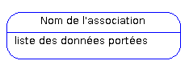

# Initiation à la conception de bases de données relationnelles avec MERISE

Ce cours est conçu pour ceux qui souhaitent s'initier rapidement à la conception d'une base de données relationnelle à l'aide de la méthode d'analyse MERISE. Il est en rapport direct avec le programme de certaines formations d'études supérieures comme le BTS Informatique de Gestion ou encore le DUT informatique.

## Informations sur l'article

L'article a été originellement publié par Idriss Neumann sur developpez.com [ici](https://ineumann.developpez.com/tutoriels/linux/bash-bonnes-pratiques/).

* Publié le 28 février 2012
* Mis à jour le 15 juin 2019
* Niveau: **tout public**
* Licence: [](https://creativecommons.org/licenses/by-nc-sa/3.0/deed.fr)

## MERISE au service des systèmes d'information

### Le système d'information

Le __système d'information__ ou SI, peut être défini comme étant l'ensemble des moyens humains, matériels et immatériels mis en œuvre afin de gérer l'information au sein d'une unité, une entreprise par exemple.

Il ne faut toutefois pas confondre un __système d'information__ avec un __système informatique__. En effet, les systèmes d'information ne sont pas toujours totalement informatisés et existaient déjà avant l'arrivée des nouvelles technologies de l'information et des communications dont l'informatique fait partie intégrante.

Le SI possède quatre fonctions essentielles :

* la __saisie__ ou __collecte__ de l'information
* la __mémorisation__ de l'information à l'aide de fichier ou de base de données
* le __traitement__ de l'information afin de mieux l'exploiter (consultation, organisation, mise à jour, calculs pour obtenir de nouvelles données…)
* la __diffusion__ de l'information

Autrefois, l'information était stockée sur papier à l'aide de formulaires, de dossiers… et il existait des procédures manuelles pour la traiter. Aujourd'hui, les systèmes informatisés, comme les systèmes de gestion de bases de données relationnelles (SGBDR), sont mis au service du système d'information.

### MERISE

MERISE est une méthode française née dans les années 70, développée initialement par __Hubert Tardieu__. Elle fut ensuite mise en avant dans les années 80, à la demande du ministère de l'Industrie qui souhaitait une méthode de conception des SI.

MERISE est donc une méthode d'analyse et de conception des SI basée sur le principe de la séparation des données et des traitements. Elle possède un certain nombre de __modèles__ (ou __schémas__) qui sont répartis sur trois niveaux :

* le niveau conceptuel
* le niveau logique ou organisationnel
* le niveau physique

Dans ce cours, nous ne nous intéresserons qu'à certains schémas permettant la conception d'une base de données relationnelle puis sa réalisation sur un SGBDR.

## Modélisation d'une base de données au niveau conceptuel

Il s'agit de l'élaboration du __modèle conceptuel des données__ (MCD) qui est une représentation graphique et structurée des informations mémorisées par un SI. Le MCD est basé sur deux notions principales : les __entités__ et les __associations__, d'où sa seconde appellation : le __schéma Entité/Association__.

L'élaboration du MCD passe par les étapes suivantes :

* la mise en place de __règles de gestion__ (si celles-ci ne vous sont pas données)
* l'élaboration du __dictionnaire des données__
* la recherche des __dépendances fonctionnelles__ entre ces données
* l'élaboration du MCD (création des __entités__ puis des __associations__ puis ajout des __cardinalités__)

### Les règles de gestion métier

Avant de vous lancer dans la création de vos tables (ou même de vos entités et associations pour rester dans un vocabulaire conceptuel), il vous faut recueillir les besoins des futurs utilisateurs de votre application. Et à partir de ces besoins, vous devez être en mesure d'établir les règles de gestion des données à conserver.

Prenons l'exemple d'un développeur qui doit informatiser le SI d'une bibliothèque. On lui fixe les règles de gestion suivantes :

* pour chaque livre, on doit connaître le titre, l'année de parution, un résumé et le type (roman, poésie, science-fiction…)
* un livre peut être rédigé par aucun (dans le cas d'une œuvre anonyme), un ou plusieurs auteurs dont on connaît le nom, le prénom, la date de naissance et le pays d'origine
* chaque exemplaire d'un livre est identifié par une référence composée de lettres et de chiffres et ne peut être paru que dans une et une seule édition
* un(e) inscrit(e) est identifié par un numéro et on doit mémoriser son nom, prénom, adresse, téléphone et adresse e-mail
* un(e) inscrit(e) peut faire zéro, un ou plusieurs emprunts qui concernent chacun un et un seul exemplaire. Pour chaque emprunt, on connaît la date et le délai accordé (en nombre de jours)
  
Ces règles vous sont parfois données, mais vous pouvez être amené à les établir vous-même dans deux cas :

* vous êtes à la fois maîtrise d'œuvre (MOE) et maîtrise d'ouvrage (MOA), et vous développez une application pour votre compte et/ou selon vos propres directives
* __ce qui arrive le plus souvent__ : les futurs utilisateurs de votre projet n'ont pas été en mesure de vous fournir ces règles avec suffisamment de précision ; c'est pourquoi vous devrez les interroger afin d'établir vous-même ces règles. N'oubliez jamais qu'en tant que développeur, vous avez un devoir d'assistance à maîtrise d'ouvrage si cela s'avère nécessaire.

### Le dictionnaire des données

C'est une étape intermédiaire qui peut avoir son importance, surtout si vous êtes plusieurs à travailler sur une même base de données, d'un volume important.

Le dictionnaire des données est un document qui regroupe toutes les données que vous aurez à conserver dans votre base (et qui figureront donc dans le MCD). Pour chaque donnée, il indique :

* le __code mnémonique__ : il s'agit d'un libellé désignant une donnée (par exemple « *titre_l* » pour le titre d'un livre)
* la __désignation__ : il s'agit d'une mention décrivant ce à quoi la donnée correspond (par exemple « *titre du livre* »)
le type de donnée :
  * __A__ ou __Alphabétique__ : lorsque la donnée est uniquement composée de caractères alphabétiques (de 'A' à 'Z' et de 'a' à 'z')
  * __N__ ou __Numérique__ : lorsque la donnée est composée uniquement de nombres (entiers ou réels)
  * __AN__ ou __Alphanumérique__ : lorsque la donnée peut être composée à la fois de caractères alphabétiques et numériques,
  * __Date__ : lorsque la donnée est une date (au format AAAA-MM-JJ)
  * __Booléen__ : Vrai ou Faux
* la __taille__ : elle s'exprime en nombre de caractères ou de chiffres. Dans le cas d'une date au format AAAA-JJ-MM, on compte également le nombre de caractères, soit 10 caractères. Pour ce qui est du type booléen, nul besoin de préciser la taille (ceci dépend de l'implémentation du SGBDR)
* et parfois des __remarques__ ou __observations__ complémentaires (par exemple si une donnée est strictement supérieure à 0, etc.).

Reprenons l'exemple de notre bibliothèque et du système de gestion des emprunts que nous sommes chargés d'informatiser. Après l'étude des règles de gestion, nous pouvons établir le dictionnaire des données suivant :

|Code mnémonique |Désignation                                 |Type|Taille|Remarque                                                       |
|----------------|--------------------------------------------|----|------|---------------------------------------------------------------|
|id_i            |Identifiant numérique d'un inscrit          |N   |      |                                                               |
|nom_i           |Nom d'un inscrit                            |A   |30    |                                                               |
|prenom_i        |Prénom d'un inscrit                         |A   |30    |                                                               |
|rue_i           |Rue où habite un inscrit                    |AN  |50    |                                                               |
|ville_i         |Ville où habite un inscrit                  |A   |50    |                                                               |
|cp_i            |Code postal d'un inscrit                    |AN  |5     |                                                               |
|tel_i           |Numéro de téléphone fixe d'un inscrit       |AN  |15    |                                                               |
|tel_port_i      |Numéro de téléphone portable d'un inscrit   |AN  |15    |                                                               |
|email_i         |Adresse e-mail d'un inscrit                 |AN  |100   |                                                               |
|date_naissance_i|Date de naissance d'un inscrit              |Date|10    |Au format AAAA-JJ-MM                                           |
|id_l            |Identifiant numérique d'un livre            |N   |      |                                                               |
|titre_l         |Titre d'un livre                            |AN  |50    |                                                               |
|annee_l         |Année de parution d'un livre                |N   |4     |                                                               |
|resume_l        |Résumé d'un livre                           |AN  |1000  |                                                               |
|ref_e           |Code de référence d'un exemplaire d'un livre|AN  |15    |Cette référence servira également d'identifiant dans ce système|
|id_t            |Identifiant numérique d'un type de livre    |N   |      |                                                               |
|libelle_t       |Libellé d'un type de livre                  |AN  |30    |                                                               |
|id_ed           |Identifiant numérique d'une édition de livre|N   |6     |                                                               |
|nom_ed          |Nom d'une édition de livre                  |AN  |30    |                                                               |
|id_a            |Identifiant numérique d'un auteur           |N   |      |                                                               |
|nom_a           |Nom d'un auteur                             |A   |30    |                                                               |
|prenom_a        |Prénom d'un auteur                          |A   |30    |                                                               |
|date_naissance_a|Date de naissance d'un auteur               |Date|      |Au format AAAA-JJ-MM                                           |
|id_p            |Identifiant numérique d'un pays             |N   |      |                                                               |
|nom_p           |Nom d'un pays                               |A   |50    |                                                               |
|id_em           |Identifiant numérique d'un emprunt          |N   |      |                                                               |
|date_em         |Date de l'emprunt                           |Date|      |Au format AAAA-JJ-MM                                           |
|delais_em       |Délai autorisé lors de l'emprunt du livre   |N   |3     |S'exprime en nombre de jours                                   |

__Remarques__

* Les données qui figurent dans le MCD (et donc dans le dictionnaire des données) doivent être, dans la plupart des cas, __élémentaires__ :
  * elles ne doivent pas être __calculées__ : les données calculées doivent être obtenues, par le calcul, à partir de données élémentaires qui, elles, sont conservées en base. Cependant, il existe quelques cas où il s'avère pertinent de conserver, pour des raisons d'optimisation, une donnée calculée, le montant d'une commande par exemple. On ne conservera cependant pas les données calculées intermédiaires sauf en cas d'obligation légale (c'est le cas pour un montant HT par exemple, où les composantes peuvent d'ailleurs avoir un prix variable dans le temps). En effet, cela évite de refaire les calculs plusieurs fois pour un résultat qui restera fixe ;
  * elles ne doivent pas être __composées__ : les données composées doivent être obtenues par la concaténation de données élémentaires conservées en base. Par exemple une adresse est obtenue à partir d'une rue, d'une ville et d'un code postal : ce sont ces trois dernières données qui sont conservées et donc qui figureront dans le MCD (et dans le dictionnaire des données).
* Lorsque l'on n'effectue jamais de calcul sur une donnée numérique, celle-ci doit être de type AN (c'est le cas par exemple pour un numéro de téléphone).

### Les dépendances fonctionnelles

Soit deux propriétés (ou données) P1 et P2. On dit que P1 et P2 sont reliées par une dépendance fonctionnelle (DF) si et seulement si une occurrence (ou valeur) de P1 permet de connaître une et une seule occurrence de P2.

Cette dépendance est représentée comme ceci :

```
P1 -> P2
```

On dit que P1 est la __source__ de la DF et que P2 en est le __but__.

Par ailleurs, plusieurs données peuvent être source comme plusieurs données peuvent être but d'une DF. Exemples :

```
P1,P2 -> P3
P1 -> P2,P3
P1,P2 -> P3,P4,P5
...
```

En reprenant les données du dictionnaire précédent, on peut établir les DF suivantes :

```
id_em -> date_em, delais_em, id_i, ref_e
id_i -> nom_i, prenom_i, rue_i, ville_i, cp_i, tel_i, tel_port_i, email_i, date_naissance_i
ref_e -> id_l
id_l -> titre_l, annee_l, resume_l, id_t, id_ed
id_t -> libelle_t
id_ed -> nom_ed
id_a -> nom_a, prenom_a, date_naissance_a, nom_p
```

On peut déduire les conclusions suivantes de ces DF :

* à partir d'un numéro d'emprunt, on obtient une date d'emprunt, un délai, l'identifiant de l'inscrit ayant effectué l'emprunt, la référence de l'exemplaire emprunté ;
* à partir d'une référence d'exemplaire, on obtient l'identifiant du livre correspondant ;
* à partir d'un numéro de livre, on obtient son titre, son année de parution, un résumé, l'identifiant du type correspondant, son numéro d'édition ;
* ...

__Remarque__

Une DF doit être :

* __élémentaire__ : c'est l'intégralité de la source qui doit déterminer le but d'une DF. Par exemple si P1 ? P3 alors P1,P2 ? P3 n'est pas élémentaire
* __directe__ : la DF ne doit pas être obtenue par transitivité. Par exemple, si P1 ? P2 et P2 ? P3 alors P1 ? P3 a été obtenue par transitivité et n'est donc pas directe
  
__Conclusion__

Les DF qui existent entre les données sont parfois évidentes et ne nécessitent pas toujours une modélisation, mais celle-ci peut s'avérer utile, car elle permet, entre autres, de distinguer les futures entités du MCD et leurs identifiants.

### Le Modèle Conceptuel de Données (MCD)

#### Les entités

Chaque entité est unique et est décrite par un ensemble de propriétés encore appelées attributs ou caractéristiques. Une des propriétés de l'entité est l'identifiant. Cette propriété doit posséder des occurrences uniques et doit être source des dépendances fonctionnelles avec toutes les autres propriétés de l'entité. Bien souvent, on utilise une donnée de type entier qui s'incrémente pour chaque occurrence, ou encore un code unique spécifique du contexte.

Le formalisme d'une entité est le suivant :


Ainsi, si on reprend notre dictionnaire de données précédent, on schématise par exemple une entité «Auteur» comme ceci :


À partir de cette entité, on peut retrouver la règle de gestion suivante : un auteur est identifié par un numéro unique (id_a) et est caractérisé par un nom, un prénom et une date de naissance.

Une entité peut n'avoir aucune, une ou plusieurs occurrences. Pour illustrer ce terme d'« occurrence » qui a déjà été utilisé plusieurs fois, voici un exemple de __table d'occurrences__ de l'entité __Auteur__ :

|id_a|nom_a        |prenom_a|date_naissance_a|
|----|-------------|--------|----------------|
|1   |Hugo         |Victor  |1802-02-26      |
|2   |Rimbaud      |Arthur  |1854-10-20      |
|3   |de Maupassant|Guy     |1850-08-05      |

Cette table est composée de trois occurrences de l'entité __Auteur__.

__Remarques__

* Les occurrences sont parfois appelées __tuples__. Par ailleurs, la table d'occurrences peut être comparée à l'instance d'une relation (implantation relationnelle d'une entité ou association) à un moment donné. Nous reviendrons sur cette notion de relation dans la partie III
* Au niveau conceptuel, on devrait plutôt parler d'__entités-types__, les entités étant en fait des instances d'entités-types. Par souci de simplicité, on gardera les termes d'entités et associations tout au long du cours

#### Les associations

Une association définit un lien sémantique entre une ou plusieurs entités. En effet, la définition de liens entre entités permet de traduire une partie des règles de gestion qui n'ont pas été satisfaites par la simple définition des entités.

Le formalisme d'une association est le suivant :



Généralement le nom de l'association est un verbe définissant le lien entre les entités qui sont reliées par cette dernière. Par exemple :


Ici l'association « être né » traduit les deux règles de gestion suivantes :

* un auteur est né dans un et un seul pays
* dans un pays, sont nés aucun, un ou plusieurs auteurs

Vous remarquerez que cette association est caractérisée par ces annotations 1,1 et 0,N qui nous ont permis de définir les règles de gestions précédentes. Ces annotations sont appelées les cardinalités.

Une cardinalité est définie comme ceci :

```
minimum, maximum
```

Les cardinalités les plus répandues sont les suivantes : `0,N`, `1,N`,  `0,1`, `1,1`. On peut toutefois tomber sur des règles de gestion imposant des cardinalités avec des valeurs particulières, mais cela reste assez exceptionnel et la présence de ces cardinalités imposera l'implantation de traitements supplémentaires.

L'identifiant d'une association ayant des cardinalités `0,N` / `1,N` de part et d'autre, est obtenu par la concaténation des entités qui participent à l'association. Imaginons l'association suivante :


Ici un auteur rédige au moins un ou plusieurs livres et pour chaque livre, on connaît le nombre de chapitres rédigés par l'auteur (on connaît aussi le nombre total de chapitres pour chaque livre).

L'association « rédiger » peut donc être identifiée par la concaténation des propriétés id_a et id_l. Ainsi, le couple __id_a__, __id_l__ doit être unique pour chaque occurrence de l'association. On peut également définir la dépendance fonctionnelle suivante :

```
id_a, id_l -> nb_chapitres
```

On dit que nb_chapitres (nombre de chapitres rédigés par un auteur, pour un livre) est une donnée portée par l'association « rédiger ». Cette association est donc une association porteuse de données.

Pour une association ayant au moins une cardinalité de type 0,1 ou 1,1 considérons dans un premier temps que cette dernière ne peut être porteuse de données et qu'elle est identifiée par l'identifiant de l'entité porteuse de la cardinalité 0,1 ou 1,1.

Nous reviendrons plus en détail sur la notion d'identification d'une association lors du passage au modèle logique.

#### Élaboration du MCD

Avec toutes ces connaissances, il nous est donc possible d'élaborer le MCD complet à partir des données présentes dans le dictionnaire des données :


__Remarques__

* Souvent, pour un même ensemble de règles de gestion, plusieurs solutions sont possibles au niveau conceptuel. Par exemple, rien ne nous obligeait ici à créer une entité __Type__. Une simple donnée portée par l'entité __Livre__ aurait pu convenir également
* Pour que le MCD soit sémantiquement valide, toute entité doit être reliée à au moins une association
* Les entités et les propriétés peuvent être historisées. Dans ce cas on met un (H) à la fin du nom de l'entité ou de la propriété que l'on souhaite historiser (cela permet de préciser que l'on archivera toutes les modifications sur une entité ou une propriété donnée). Cela doit également répondre à une règle de gestion.
* Il existe des outils de modélisation payants et d'autres gratuits pour MERISE (powerAMC, OpenModelSphere, AnalyseSI, JMerise...)
* On aurait pu, dans ce cas précis, conserver également une date de rentrée des livres, calculée à partir de la date de location et de la durée de celle-ci. C'est un exemple de donnée calculée dont la conservation peut s'avérer pertinente (notamment pour faciliter l'envoi de rappels)

## Modélisation d'une base de données au niveau logique et passage au SQL

Dans cette partie, nous allons voir comment établir une modélisation des données au niveau logique (ou relationnel) à partir d'un modèle conceptuel, puis comment passer à l'étape de création des tables (cela suppose d'avoir une connaissance préalable des requêtes SQL de création de tables).

### Le passage du MCD au MLD et SQL

#### Les relations

Le modèle logique de données (MLD) est composé uniquement de ce que l'on appelle des __relations__. Ces relations sont à la fois issues des entités du MCD, mais aussi d'associations, dans certains cas. Ces relations nous permettront par la suite de créer nos tables au niveau physique.

Une relation est composée d'attributs. Ces attributs sont des données élémentaires issues des propriétés des différentes entités, mais aussi des identifiants et des données portées par certaines associations.

Une relation possède un nom qui correspond en général à celui de l'entité ou de l'association qui lui correspond. Elle possède aussi une __clef primaire__ qui permet d'identifier sans ambiguïté chaque occurrence de cette relation. La clef primaire peut être composée d'un ou plusieurs attributs, il s'agit d'une implantation de la notion d'identifiant des entités et associations qui se répercute au niveau relationnel.

Voici un premier exemple de relation (issue de l'entité « Edition » de notre précédent MCD) :

**Edition** (***id_ed***, nom_ed)

__Légende :__
**x** : relation
***x*** : clef primaire

__Remarques__

* Ce premier MLD est représenté de manière textuelle. C'est notamment cette représentation que l'on retrouve dans beaucoup de formations d'études supérieures. Il existe toutefois une représentation graphique équivalente
* Il est important d'accompagner un MLD textuel d'une légende (ce dernier n'ayant pas de formalisme normé). Ceci est d'ailleurs exigé dans certaines formations.

Il existe un autre type de clef appelé __clef étrangère__. La clef étrangère est un attribut d'une relation qui fait référence à la clef primaire d'une autre relation (ces deux clefs devront donc avoir le même type de données).

Complétons notre premier exemple avec une autre relation où apparaît une clef étrangère :

**Edition** (***id_ed***, nom_ed)
**Exemplaire** (***ref_e***, *id_ed*#)

__Légende :__
**x** : relation
***x** : clef primaire
*x*# : clef étrangère

__Remarques__

* Au niveau relationnel, on devrait plutôt parler de __clef candidate__ qui permet d'identifier sans ambiguïté une occurrence de la relation pour les clefs primaires. De même, on devrait désigner une clef étrangère par une __contrainte d'inclusion__ vers une clef candidate. Par souci de simplicité, on gardera les termes de clefs primaires et étrangères
* Par convention, on fait précéder ou suivre la clef étrangère du symbole `#`. Ceci n'est pas une obligation à partir du moment où les légendes sont suffisamment précises
* Ici la clef étrangère présente dans la relation « Exemplaire » fait référence à la clef primaire de la relation « Edition »
* Une relation peut posséder aucune, une ou plusieurs clefs étrangères, mais possède toujours une et une seule clef primaire

Enfin, vous pouvez également rencontrer le terme de __cardinalité de la relation__ qui signifie ici le nombre d'occurrences d'une relation (ou nombre d'entrées dans la table correspondante) et le terme de __degré de la relation__ qui correspond au nombre d'attributs d'une relation.

#### Règles de conversion

Comme cela a déjà été dit précédemment, les relations du MLD sont issues des entités du MCD et de certaines associations. Nous allons maintenant aborder ces règles de conversion de façon plus précise.

##### Règle 1 - conversion d'une entité

En règle générale, toute entité du MCD devient une relation dont la clef est l'identifiant de cette entité. Chaque propriété de l'entité devient un attribut de la relation correspondante.

Il existe toutefois quelques cas particuliers que vous pourrez voir au paragraphe "Cas particuliers".

##### Règle 2 - conversion d'associations n'ayant que des cardinalités de type `0/1,N`

Une association ayant des cardinalités `0,N` ou `1,N` de part et d'autre devient une relation dont la clef est constituée des identifiants des entités reliées par cette association. Ces identifiants seront donc également des clefs étrangères respectives. On parle de __relations associatives__.

Les cardinalités plus restrictives (comme `2,3`, `1,7`...) seront perçues comme des cardinalités de type `0/1,N` également (il s'agit en effet de sous-ensembles). Cependant, les règles de gestion qui ne seront plus satisfaites par cette modélisation logique devront l'être par des traitements supplémentaires (via le code de l'application qui exploite la base de données ou encore par des triggers (déclencheurs) si le SGBDR est suffisamment robuste).

Voici un exemple de relation associative issu de l'association « rédiger » de notre MCD :

**Rediger** (***id_a#, id_l#***)

__Légende :__
**x** : relation
***x*** : clef primaire
*x*# : clef étrangère

Dans le cas d'associations porteuses de données, les données portées deviennent des attributs de la relation correspondante. Si l'on reprend cet exemple :


L'association « rédiger » devrait maintenant être traduite comme ceci :

**Rediger** (***id_a#, id_l#***, nb_chapitres)

__Légende :__
**x** : relation
***x*** : clef primaire
*x*# : clef étrangère

##### Règle 3 - conversion des associations ayant au moins une cardinalité de type `1,1`

Plusieurs possibilités s'offrent à nous pour ce cas de figure. La règle de conversion la plus répandue aujourd'hui est d'ajouter une clef étrangère dans la relation qui correspond à l'entité se situant du côté de cette cardinalité 1,1. Cette clef étrangère fera donc référence à la clef de la relation correspondant à la seconde entité reliée par l'association.

Prenons un exemple issu de l'association « être originaire de » et des entités « Auteur » et « Pays » :

**Pays** (***nom_p***)
**Auteur** (***id_a***, nom_a, prenom_a, date_naissance_a, *nom_p*#)

__Légende :__
**x** : relation
***x*** : clef primaire
*x*# : clef étrangère

Lorsque l'on applique cette règle de conversion, deux restrictions s'imposent :

* l'association ne peut être porteuse de données. Les données portées sont en dépendances fonctionnelles directes avec l'identifiant de l'entité dont la clef correspondante sera référencée par une clef étrangère dans une autre relation
* l'association doit être binaire (c'est-à-dire relier uniquement deux entités et pas plus)

Lorsque deux entités sont toutes deux reliées avec une cardinalité `1,1` par une même association, on peut placer la clef étrangère de n'importe quel côté. Par convention, on choisit de la placer du côté de la relation correspondant à l'entité ayant le plus de liaisons avec les autres. Certains considèrent d'ailleurs que deux entités étant reliées par une association ayant une cardinalité `1,1` des deux côtés, doivent obligatoirement fusionner. Cette règle s'appuie encore une fois sur la notion de dépendances fonctionnelles directes, mais n'est pas toujours respectée (il est parfois sémantiquement préférable de garder une distinction entre les deux entités).

Une autre solution (moins répandue) consiste à créer une relation associative dont la clef est cette fois composée uniquement de la clef étrangère qui fait référence à l'identifiant de l'entité du côté opposé à la cardinalité `1,1`.

Si on reprend le même exemple, voici ce que l'on devrait obtenir :

**Pays** (***nom_p***)
**Auteur** (***id_a***, nom_a, prenom_a, date_naissance_a)
**EtreOriginaireDe** (***id_a#, nom_p#***)

__Légende :__
**x** : relation
***x*** : clef primaire
*x*# : clef étrangère

Dans ce cas, l'association peut être porteuse de données. Ces dernières deviendront donc des attributs de la relation associative comme dans le cas des cardinalités `0,1/N`.

Il va sans dire que la première solution est aujourd'hui préférable à cette dernière en termes d'optimisation et de simplification des requêtes.

##### Règle 4 - conversion des associations ayant au moins une cardinalité de type `0,1` (et dont les autres cardinalités sont de type `0,1/N`)

De même que pour les cardinalités `1,1`, une association ayant une cardinalité `0,1` doit être binaire, et les deux mêmes possibilités s'offrent à nous :

* créer la clef étrangère dans la relation correspondant à l'entité du côté de la cardinalité `0,1`. Rappelons que dans ce cas, l'association ne peut pas être porteuse de données
* créer une relation associative qui serait identifiée de la même façon que pour une cardinalité `1,1`.

Cependant, dans le cadre d'une cardinalité `0,1`, nous verrons qu'il n'est pas toujours préférable de privilégier la première méthode comme c'est le cas pour une cardinalité `1,1`.

Imaginons par exemple qu'un livre puisse appartenir à 0 ou 1 catégorie, on obtient le MCD suivant :


Certains diront que toutes les associations binaires de type père-fils ayant des cardinalités 1,N/0,N - 1,1/0,1 sont caractérisées par l'existence d'une dépendance fonctionnelle entre l'identifiant de l'entité père (ici id_cat) et de l'entité fils (ici id_l). Cette dépendance fonctionnelle se schématiserait ainsi :

```
id_l -> id_cat
```

Dans ce cas, il apparaît logique de traduire le MCD de cette façon (première méthode) :

**Categorie** (***id_cat***, libelle_cat)
**Livre** (***id_l***, titre_l, annee_l, resume_l, *id_cat*#)

__Légende :__
**x** : relation
***x*** : clef primaire
*x*# : clef étrangère

Cependant même si les SGBD le permettent (avec la valeur `NULL` par défaut), il n'est normalement pas permis d'avoir une clef étrangère sans valeur pour laquelle on retrouverait l'occurrence dans la relation sur laquelle on fait référence.

C'est pourquoi d'autres pensent (avec raison) qu'il vaut mieux créer une relation associative de cette manière (seconde méthode) :

**Categorie** (***id_cat***, libelle_cat)
**Livre** (***id_l***, titre_l, annee_l, resume_l)
**Appartenir** (***id_l#, id_cat#***)

__Légende :__
**x** : relation
***x*** : clef primaire
*x*# : clef étrangère

La pertinence de l'une ou l'autre méthode varie en fonction du nombre d'occurrences caractérisées par la cardinalité 0 ou la cardinalité 1. En effet, lorsque les occurrences avec la cardinalité 1 sont plus nombreuses que les occurrences avec la cardinalité 0, la première méthode est préférable. Dans le cas contraire, c'est la seconde méthode qui est la plus adaptée.

Enfin, dans le cas où une association binaire possède à la fois une cardinalité 0,1 et une cardinalité `1,1` (ce qui est rarement le cas), il est préférable que la clef étrangère soit du côté de la relation correspondant à l'entité située du côté de la cardinalité `1,1`.

#### Élaboration du MLD et passage au SQL

Avec ces différentes règles de conversion, il nous est déjà possible de convertir notre MCD au complet :

**Pays** (***id_p***, nom_p)
**Auteur** (***id_a***, nom_a, prenom_a, date_naissance_a, *id_p*#)
**TypeLivre** (***id_t***, libelle_t)
**Livre** (***id_l***, titre_l, annee_l, resume_l, id_t#)
**Rediger** (***id_a#, id_l#***)
**Edition** (***id_ed***, nom_ed)
**Exemplaire** (***ref_e***, *id_ed*#, *id_l*#)
**Inscrit** (***id_i***, nom_i, prenom_i, date_naissance_i, rue_i, ville_i, cp_i, email_i, tel_i, tel_portable_i)
**Emprunt** (***id_em***, date_em, delais_em, *id_i*#, *ref_e*#)

__Légende :__
**x** : relation
***x*** : clef primaire
*x*# : clef étrangère

Comme vous pouvez le constater, le schéma de la base est déjà fait. Les règles de passage au SQL sont assez simples :

* chaque relation devient une table
* chaque attribut de la relation devient une colonne de la table correspondante
* chaque clef primaire devient une `PRIMARY KEY`
* chaque clef étrangère devient une `FOREIGN KEY`

Voici ce que cela donnerait :

```sql
CREATE TABLE Pays ( 
  id_p INT NOT NULL,
  nom_p VARCHAR(50), 
  PRIMARY KEY (id_p) 
); 

CREATE TABLE Auteur ( 
  id_a INT NOT NULL, 
  nom_a VARCHAR (30), 
  prenom_a VARCHAR (30), 
  date_naissance_a DATE, 
  id_p INT NOT NULL, 
  FOREIGN KEY (id_p) REFERENCES Pays(id_p), 
  PRIMARY KEY (id_a) 
); 

CREATE TABLE TypeLivre ( 
  id_t INT NOT NULL, 
  libelle_t VARCHAR (30), 
  PRIMARY KEY (id_t) 
); 

CREATE TABLE Livre ( 
  id_l INT NOT NULL, 
  titre_l VARCHAR (254), 
  annee_l VARCHAR (4), 
  resume_l TEXT, 
  id_t INT NOT NULL, 
  FOREIGN KEY (id_t) REFERENCES TypeLivre(id_t), 
  PRIMARY KEY (id_l) 
); 

CREATE TABLE Rediger ( 
  id_a INT NOT NULL, 
  id_l INT NOT NULL, 
  FOREIGN KEY (id_a) REFERENCES Auteur(id_a), 
  FOREIGN KEY (id_l) REFERENCES Livre (id_l), 
  PRIMARY KEY (id_a, id_l) 
); 

CREATE TABLE Edition ( 
  id_ed INT NOT NULL, 
  nom_ed VARCHAR (254), 
  PRIMARY KEY (id_ed) 
); 

CREATE TABLE Exemplaire ( 
  ref_e VARCHAR(254) NOT NULL, 
  id_ed INT NOT NULL, 
  id_l INT NOT NULL, 
  FOREIGN KEY (id_ed) REFERENCES Edition (id_ed), 
  FOREIGN KEY (id_l) REFERENCES Livre(id_l), 
  PRIMARY KEY (ref_e) 
); 

CREATE TABLE Inscrit ( 
  id_i INT NOT NULL, 
  nom_i VARCHAR (30), 
  prenom_i VARCHAR (30), 
  date_naissance_i DATE, 
  rue_i VARCHAR(50), 
  ville_i VARCHAR(50), 
  cp_i VARCHAR (5), 
  tel_i VARCHAR(15), 
  tel_portable_i VARCHAR(15) ,
  email_i VARCHAR(100),
  PRIMARY KEY (id_i)
); 

CREATE TABLE Emprunt ( 
  id_em INT NOT NULL, 
  date_em DATE, 
  delais_em INT DEFAULT 0, 
  id_i INT NOT NULL, 
  ref_e VARCHAR (254) NOT NULL, 
  FOREIGN KEY (id_i) REFERENCES Inscrit(id_i), 
  FOREIGN KEY (ref_e) REFERENCES Exemplaire(ref_e), 
  PRIMARY KEY (id_em) 
);
```

__Remarque :__ il est possible de ne pas avoir à gérer l'incrémentation des identifiants par soi-même lors des INSERT avec la plupart des SGBD.

Exemple d'auto-incrémentation sous MySQL :

```sql
CREATE TABLE TypeLivre ( 
  id_t INT AUTO_INCREMENT, 
  libelle_t VARCHAR (30), 
  PRIMARY KEY (id_t) 
);
```

Sous PostgreSQL :

```sql
CREATE TABLE TypeLivre ( 
  id_t SERIAL, 
  libelle_t VARCHAR (30), 
  PRIMARY KEY (id_t) 
);
```

`SERIAL` créera implicitement une séquence qui s'incrémente avec un pas de 1. Sous Oracle, il faudrait créer soi-même cette séquence.

### Règles de vérification des niveaux de normalisation

Il existe différents niveaux de normalisation (ou formes normales). Les trois premiers niveaux de normalisations sont les plus répandus et les plus appliqués.

La classification de ces trois premiers niveaux de normalisation repose sur les dépendances fonctionnelles entre la clef primaire de la relation et ses autres attributs.

* __Pour être en première forme normale (1FN ou 1NF) :__ les attributs d'une relation doivent être atomiques et doivent être en dépendance fonctionnelle avec la clef primaire de cette dernière
* __Pour être en deuxième forme normale (2FN ou 2NF) :__ il faut être en 1FN et que toutes les dépendances fonctionnelles entre la clef primaire et les autres attributs de la relation soient élémentaires. Autrement dit, les attributs doivent dépendre de la totalité de la clef
* __Pour être en troisième forme normale (3FN ou 3NF) :__ il faut être en 2FN et que toutes les dépendances fonctionnelles entre la clef primaire de la relation et les autres attributs soient directes


> /!\ Il ne s'agit pas de définitions précises, mais de simples règles de vérification des trois premiers niveaux de normalisation.
> Pour plus de détails sur les formes normales, vous pouvez consulter [ce cours](https://fsmrel.developpez.com/basesrelationnelles/normalisation/).

__Remarques__

* Pour que le MLD soit valide, il faut que chacune de ses relations soit au moins en 3FN
* Si un MCD est correctement conçu et que les règles de conversion énoncées plus haut ont bien été respectées, les relations seront donc automatiquement normalisées en 3FN
